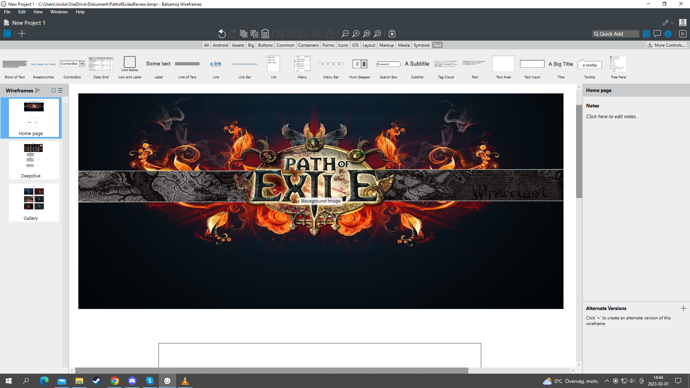
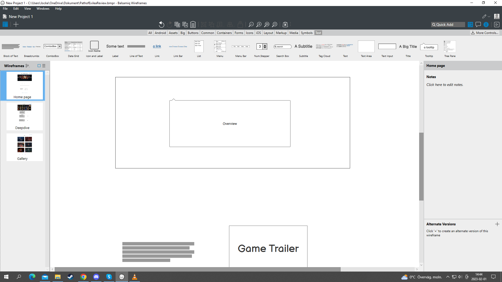
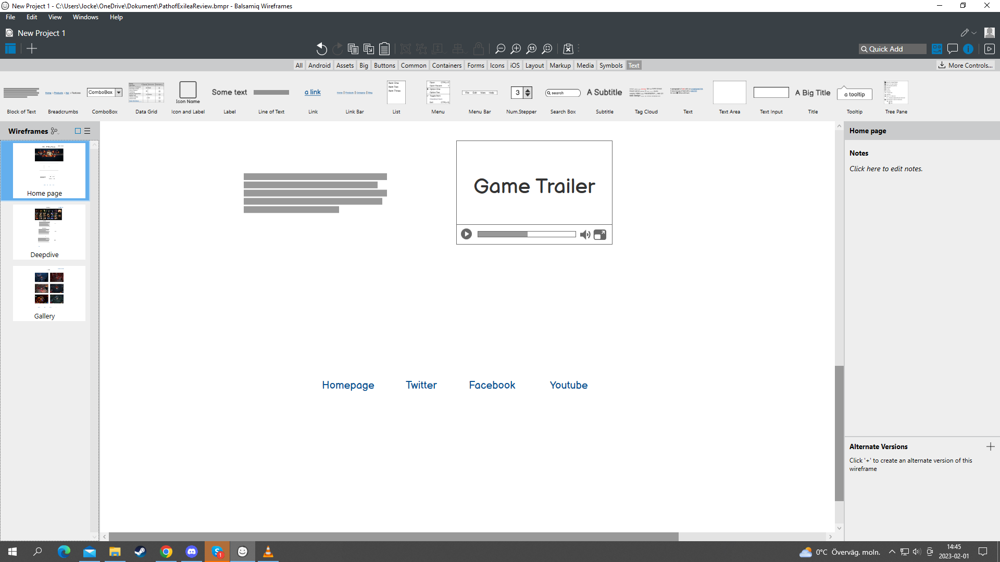
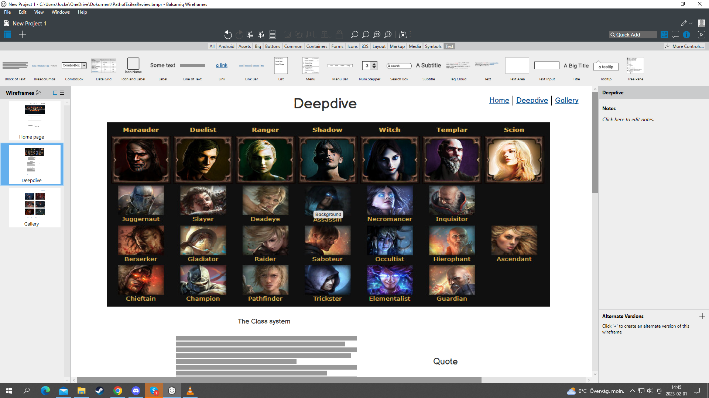
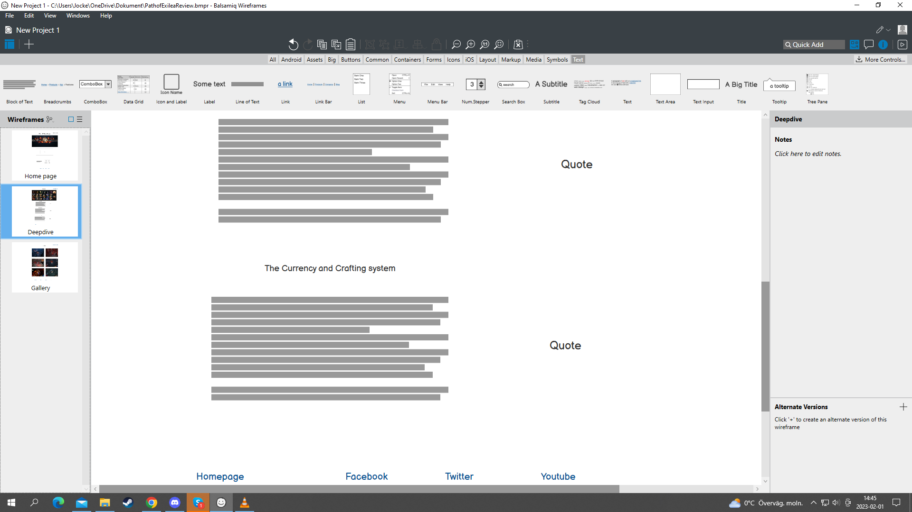
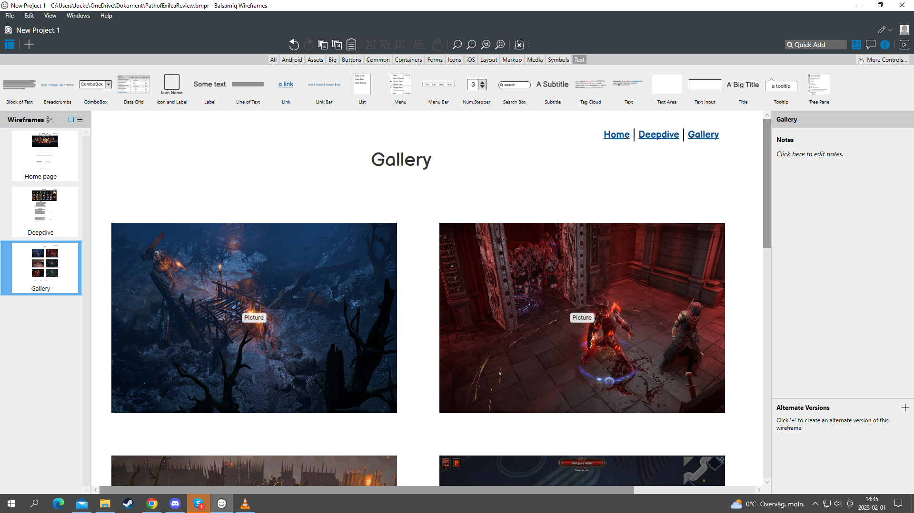
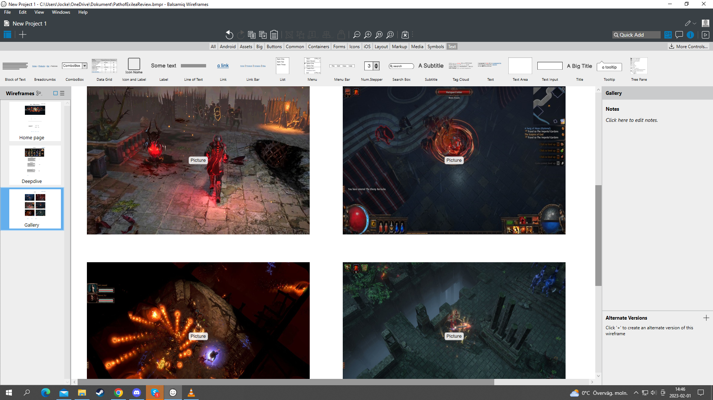

1. Purpose of project

* Adding a good way for gamers to find information about a potential new game.
* With including images getting people a better idea how the game looks.
* With the deepdive section give a better understanding for different parts of the game.
* Getting more people intrerested in the game to grow the community.

2. User Stories

* I want to see if Path of Exile is a game for me.
* I am looking for a new game for me and my friends to play together.
* I want to get a better understanding of what this game offers.
* I want to see if the graphics of the game is better then the standard.
* I need it to be easy to navigate around the website.
* I need to see who have done this site so i can look them up for other work.

3. Features

* Header 1: Gives a clear explanation for what the website is about.

* Navigation-bar: Gives the user a easy way to navigate the website.

* Main-image: Indicates even more what to expect from the website.

* Section 1: Gives an overview about some of the main features of the game.

* Header 2: Describes the league system and what the current league is.

* Media player: Plays the current league trailer.

* Social links: Gives links to, Path of Exile homepage, Twitter, Facebook and Youtube.

* Deepdive Header 1: Gives the user info about what will be presented in this section of the wesite.

* Class image: Gives the user a visual indication what will be included in the deepdive.

* Header 2 part1: Gives information about the class system i Path of Exile.

* Header 2 part2: Informes the viewer about the acendancy system.

* Header 2 part3: Goes over the currency and crafting system of the game.

* Gallery header: Indicates what will be presented an the current page.

* Images: Gives several images of the game from several views.

4. Future Features:

* A forum section where people can post topics they want information about.

* A signup section where users enter information to give them access to the forum section.

* A guide section where people can get help in larger areas of the game.

5. * color name="Raw Umber" hex="7E643E" r="126" g="100" b="62" 
   * color name="Smoky Black" hex="12100E" r="18" g="16" b="14" 
   * color name="Old Lace" hex="F8F2E5" r="248" g="242" b="229" 

   * Text: Lucida Console, Sans-serif

6. -  
- 
- 
- 
- 
- 
- 
- 

7.  Tech used: html, css, github, gitpod.

8. Testing: - code validation html <link https://validator.w3.org/nu/?doc=https%3A%2F%2Fcashy91.github.io%2FPath-of-Exile-a-review%2F>
            - code validation css <link>

   cases:   - 

   buggs fixed: - 

   supported screens and browsers: -  screens used: Iphone SE, Ipad air and 4-K in Google Chrome, Microsoft Edge and Mozrilla Firefox

9. Deployment:   Gitpod: 

               - Github: 

10. * Credits:                

                                                    

  
