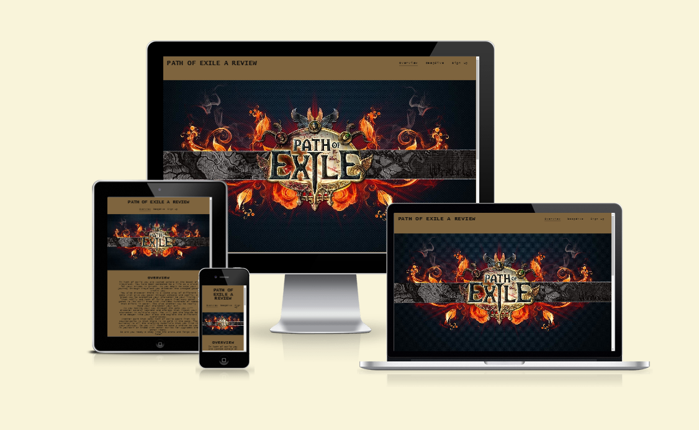
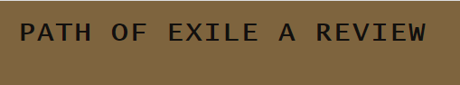
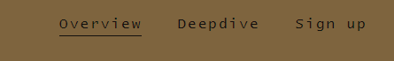
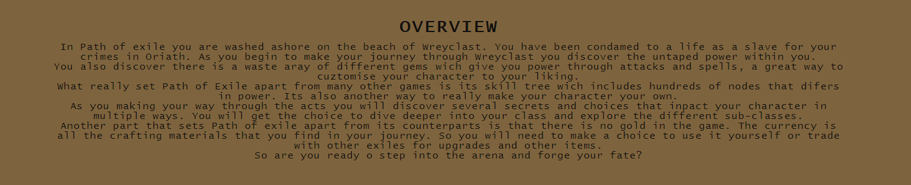
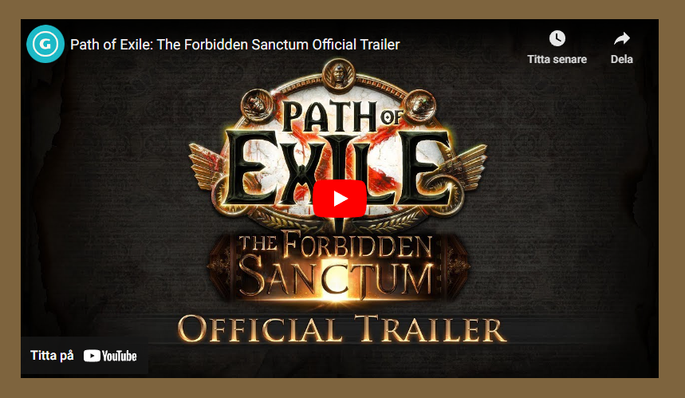
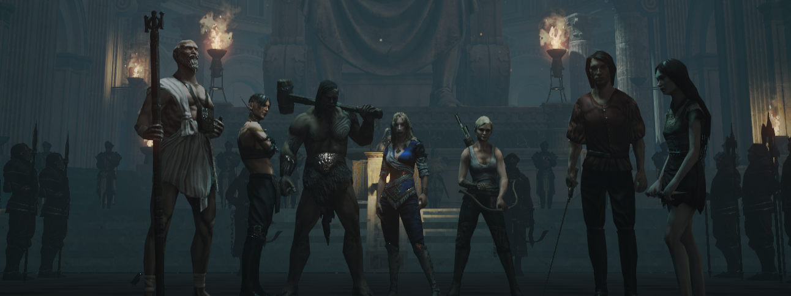
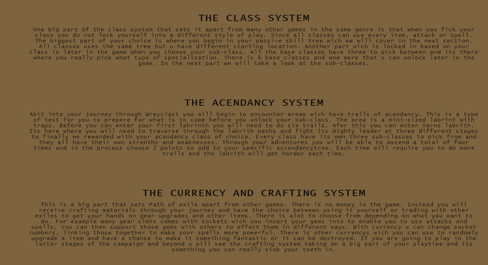
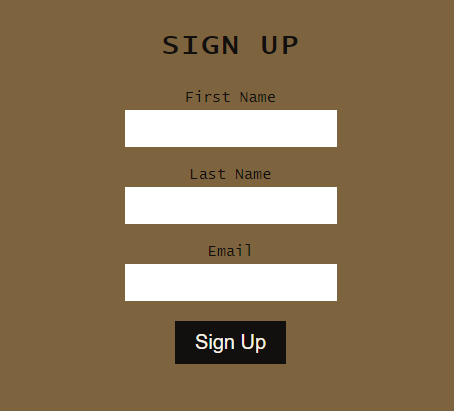

<h1>1. Purpose of project</h1>

* Adding a good way for gamers to find information about a potential new game.

* With including images getting people a better idea how the game looks.

* With the deepdive section give a better understanding for different parts of the game.

* Getting more people intrerested in the game to grow the community.

<h1>2. User Stories</h1>

* As a visiting viewer want to see if Path of Exile is a game for me.

* As a visiting viewer I would like to know if this game can be played together with my friends.

* As a visiting viewer I want to get information about the games different mechanics for better understanding.

* As a visiting viewer I would like to be able to sign up for more news about the game.

* As a visitor I would like to be able to use my mobile when visiting the site.

<h1>3. Features </h1>

* Header : Gives a clear explanation for what the website is about.
 

* Navigation-bar: Gives the user a easy way to navigate the website.

* Main-image: Shows the name of the game thats beeing reviewed.

* Section 1: Gives an overview about some of the main features of the game.
 

* Media player: Plays the current league trailer.

* Footer: Gives links to, Path of Exile homepage, Twitter, Facebook and Youtube.

* Class image: Gives the user a visual indication what will be included in the deepdive and what characters might look like.

* Deepdive section: Gives the viewer an indepth look into several part of the game.

* Sign-up form: Gives the user the chance to sign up to the webpage.

<h1>4. Future Features:</h1>

* A forum section where people can post topics they want information about.

* A signup section where users enter information to give them access to the forum section.

* A guide section where people can get help in larger areas of the game.

<h1>5. Typography and color scheme:</h1>

   * color name="Raw Umber" hex="7E643E" r="126" g="100" b="62" 

   * color name="Smoky Black" hex="12100E" r="18" g="16" b="14" 

   * color name="Old Lace" hex="F8F2E5" r="248" g="242" b="229" 

   * Text: Lucida Console, Sans-serif

<h1>6. Wireframes from the planning.</h1>

 Changed alot along the way to implement a sign up form instead of the gallery page beeing the main change.

 

<h1>7.  Tech Used </h1> 

html, css, javascript, github, gitpod and balsamic wireframes.

<h1>8. Testing:</h1> 
Code validation html <https://validator.w3.org/nu/?doc=https%3A%2F%2Fcashy91.github.io%2FPath-of-Exile-a-review%2F>  
code validation css <https://jigsaw.w3.org/css-validator/validator?uri=https%3A%2F%2Fcashy91.github.io%2FPath-of-Exile-a-review%2F&profile=css3svg&usermedium=all&warning=1&vextwarning=&lang=sv#warnings>

   cases:   - 

   buggs fixed: - none found

   Supported screens and browsers: 

   Iphone SE, Ipad air and 4-K in Google Chrome, Microsoft Edge and Mozrilla Firefox

<h1>9. Deployment</h1> 

- The page was deployed through github-pages.
The first step navigate to the repository and select settings. 
- Pick the page selector at the left.  
- Choose main in the branch drop-down.  
- When this is done a link will apear at the top giving you a direct link to the homepage.

- A link to the page can be found here: <https://cashy91.github.io/Path-of-Exile-a-review/>

                  

<h1>10. Credits</h1>   Footer icons taken from: <https://fontawesome.com/>  
               Background image for the index.html taken from: <https://wall.alphacoders.com/by_sub_category.php?id=228645&name=Path+Of+Exile+Wallpapers>
            
            
               Also big credit to my mentor that helped me through this process!        

                                                    

  
